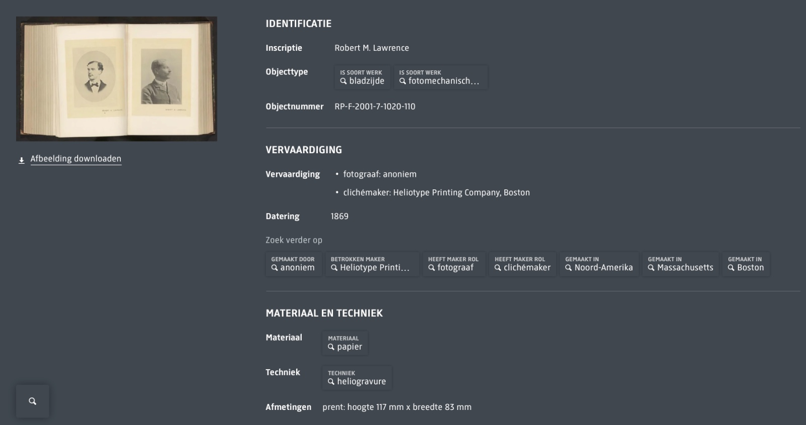

# Knowledge Graph: Rijksmuseum Data
## Lena Pickartz & Bhagyasha Patil

## 1. Data Set

### Source
- **Rijksmuseum Data Dumps**  
  [Historical Dumps](https://data.rijksmuseum.nl/docs/data-dumps/historical-dumps)
- The Rijksmuseum is the national museum of the Netherlands established in 1800 and is located in Amsterdam. It moves you through more than 8,000 works of Dutch art and history including masterpieces by Vermeer, Rembrandt, and Van Gogh.
- The dataset utilized in this project is provided by the Rijksmuseum as part of their open data initiative.

### Dataset Information
- **Dataset**: LIDO dataset (`202020-rma-lido-collection.zip`)  
  - **Size**: 11.6 GB

### Example record

### Subset
**Query Subset**: Photo Print Subset  
  - **Size**: 454 MB  
  - **Details**: Contains over 100+ LIDO classes  
  - **Mapping Fields**:
      - Inventory
      - Title
      - Creator
      - Inception
      - Material

## 2. LIDO (Lightweight Information Describing Objects)
- LIDO is an XML-based metadata schema designed for describing and sharing cultural heritage objects
- It is widely used by museums, galleries, and cultural institutions to standardize object metadata and facilitate interoperability across platforms like Europeana
- LIDO organizes data into structured classes, such as object identification, events, and relationships, enabling detailed documentation
- Its alignment with Linked Open Data principles enhances accessibility and connectivity, making cultural data globally discoverable and reusable

## 3. Wikibase
 - Wikibase is an open-source platform for managing structured data, widely used for collaborative knowledge sharing (e.g., Wikidata)
  - **Instance Creation**: Deploy on a server or use a cloud solution; configure structure and import data
  - **Properties**: Define attributes and relationships between entities (e.g., "creator," "inception date")
  - **JSON** : Native format for data storage, API interactions, and import/export, ensuring compatibility with Linked Open Data standards

## 4. Tools and Technologies

### Preprocessing
- The XML data from the LIDO dataset was **converted to JSON** for easier and more flexible processing in subsequent steps

### Data Integration
- **Wikibase cloud**  
- **Wikidata**  
- **Pywikibot**

## 5. Workflow Overview
- Data Extraction
- Data Transformation
- Metadata(Property) Mapping
  
| Entities        | Wikibase (our Instance)| Wikidata             | Datatype        |
|-----------------|------------------------|----------------------|-----------------|
| Inventory Number| P1                     | P217                 | String          |
| Title           | P2                     | P1476                | Monolingualtext |
| Creator         | P3                     | P170                 | Wikibase-item   |
| Inception       | P4                     | P571                 | Point in Time   |
| Material        | P5                     | P186                 | Wikibase-item   |

- Data Integration

## 6. Challenges
 - Large data size
 - Highly nested data structure
 - Ambigious data types
 - Data extraction errors

## 7. Future Work
- Expanding the subset
- Try to import the photos

## 8. References
- [Wikibase Documentation](https://www.mediawiki.org/wiki/Wikibase)
- [Pywikibot Manual](https://www.mediawiki.org/wiki/Manual:Pywikibot/)
- [ICOM International Committee for Documentation, What is LIDO?](https://cidoc.mini.icom.museum/working-groups/lido/lido-overview/about-lido/what-is-lido/)

## 9. Questions?

### Questions from Our End

---

